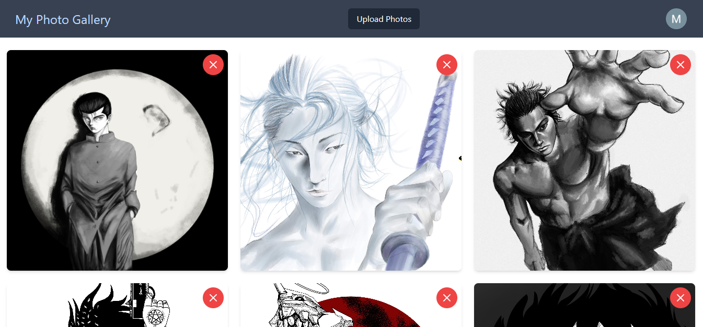

<h1>Photo Gallery</h1>

This is a web application that allows users to upload and view photos in a gallery. It was built with React, Firebase and TailwindCSS.

<h2>Installation</h2>
<ol>
  <li>Clone the repository to your local machine.</li>
  <li>Navigate to the project directory and run npm install.</li>
  <li>Create a Firebase project and enable Firebase Storage.</li>
  <li>Create a config folder in the src directory.</li>
  <li>Create a firebase.js file in the config folder and add the following code:</li>
</ol>
<pre><code>&lt;script type="text/javascript"&gt;
import { initializeApp } from 'firebase/app';
import { getAuth } from 'firebase/auth';
import { getStorage } from 'firebase/storage';

const firebaseConfig = {
  // Your Firebase config goes here
};

const app = initializeApp(firebaseConfig);
const auth = getAuth(app);
const storage = getStorage(app);

export { auth, storage };
&lt;/script&gt;
</code></pre>

Replace firebaseConfig with your Firebase project's configuration object.

Run npm start to start the application.

<h2>Usage</h2>

Login

To access the photo gallery, you must first login. Click the "Login" button in the header, and then choose the Google account you want to use to login.

Upload Photos

After logging in, you can upload photos to the gallery by clicking the "Upload Photos" button in the header. Select one or more image files and click "Open" to upload them.

View Photos

The photo gallery displays all of the photos that have been uploaded to Firebase Storage. Click on a photo to view it in a larger size.

Delete Photos

To delete a photo, click the "Delete" button that appears when you hover over a photo. Confirm that you want to delete the photo when prompted.

<h1>Screenshot:</h1>

